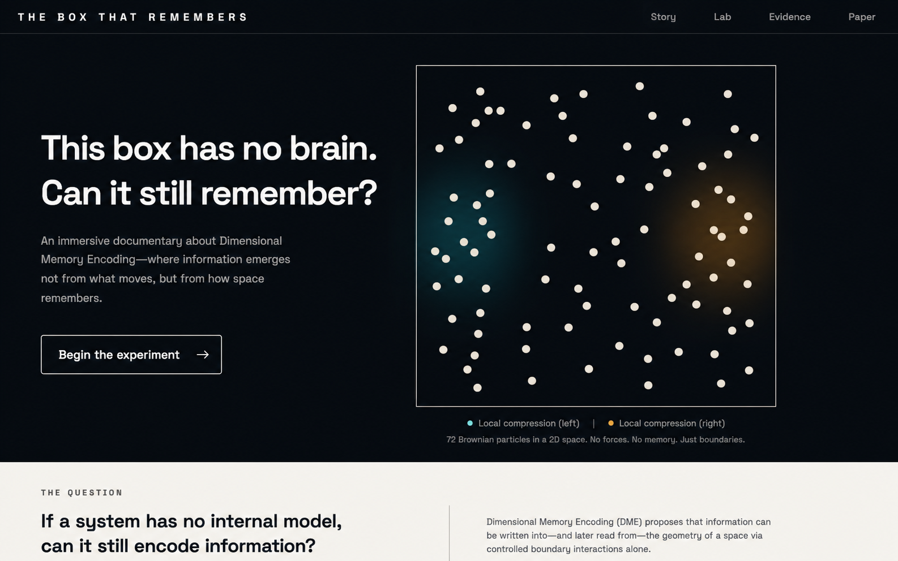

# The Box That Remembers

[](https://dimensional-memory-encoding.vercel.app/) [](https://github.com/SatyajitBeura2468/dimensional-memory-encoding/actions/workflows/ci.yml) [](https://github.com/SatyajitBeura2468/dimensional-memory-encoding/releases/tag/v3.0.0) [](https://opensource.org/license/mit) [](https://doi.org/10.5281/zenodo.17943112)

An immersive public-facing explanation of **Dimensional Memory Encoding (DME)** — a computational soft-matter study by Satyajit Beura.

**Live site:** [dimensional-memory-encoding.vercel.app](https://dimensional-memory-encoding.vercel.app/)

> A memory is a past that can still be read.



The site guides visitors through two matched compression histories, shows why bulk observables do not reliably reveal their order, reveals a local interaction-pressure fingerprint, attacks that explanation with spatial shuffling, and explores the fading trace with a later weak probe.

## Scientific scope

This website is about DME only. It does not make claims about quantum memory, extra dimensions, consciousness, all matter, or a new physical force.

The core interpretation is deliberately narrow: local interaction-pressure geometry can act as a transient, distributed, mechanically readable carrier of temporal-order information in a driven Brownian soft-particle system.

**Important:** This website is a public-facing interactive explanation of the DME Version 3 computational paper. Browser simulations are educational reconstructions unless explicitly identified as archived research outputs.

## Routes

- `/` — guided scrollytelling experiment
- `/lab` — interactive browser reconstruction with layer and weak-probe controls
- `/evidence` — exact locked Version 3 results, controls, and limitations
- `/paper` — paper identity, abstract, method map, glossary, and citation

## What visitors can do

- interact with exactly 72 softly moving particles
- reveal contacts, trails, periodic motion, and slow motion
- replay both matched pulse orders
- compare bulk measurements with 6 × 6 density and pressure fields
- shuffle field locations while preserving every value
- move through the published decay delays
- compare the later weak-probe response
- explore a live browser reconstruction in the laboratory
- switch exact evidence charts to accessible data tables

The particle reconstruction runs in a Web Worker so the main interface remains responsive. Deterministic seeded states make comparisons repeatable.

The `/paper` route is the publication landing page with the operational question, model table, accessible equations, locked results, provenance ledger, and APA/IEEE/Chicago/BibTeX/RIS/plain-text citations. `/history` documents the neutral supersession boundary from the exploratory preprint to Version 3.

## Key result

At the first recorded moment after drive removal, interaction-pressure maps achieved **90.8% balanced accuracy** (95% interval 87.3%–94.2%) when distinguishing matched histories with opposite temporal order. Spatially shuffling the map locations reduced the mean result to chance.

## Local development

```bash
npm install
npm run dev
```

## Validation

```bash
npm run format:check
npm run lint
npm run test
npm run build
npm run test:e2e
npm run check:links
npm audit --omit=dev
```

## Accessibility

The interface uses semantic landmarks, keyboard-operable controls, visible focus states, responsive layouts, text equivalents for the main visual claims, accessible evidence-table fallback, and reduced-motion support.

## Project structure

```
src/
  components/  visual, chart, and navigation primitives
  data/        locked Version 3 facts and claim classes
  pages/       Story, Lab, Evidence, and Paper routes
  simulation/  worker-based reconstruction and tested physics helpers
e2e/           desktop and mobile browser journeys
```

## Deployment

Vercel is configured for a Vite single-page application with route rewrites. Production: [dimensional-memory-encoding.vercel.app](https://dimensional-memory-encoding.vercel.app/)

## Limitations

Scalar local pressure did not successfully predict the complete noisy future local-flow field. Pressure is a useful history-bearing coordinate, not a complete description of future motion.

## Author and licence

Satyajit Beura · Independent Student Researcher · Bhawanipatna, Odisha, India.

Released under the MIT licence. Contributions should preserve the locked paper-facts source and clearly distinguish reconstructions from archived research data.

Before proposing changes, run formatting, lint, unit tests, the production build, and the Playwright journeys. Scientific copy must retain one of the explicit claim classes: `direct-result`, `interpretation`, `prediction`, `analogy`, or `limitation`.
